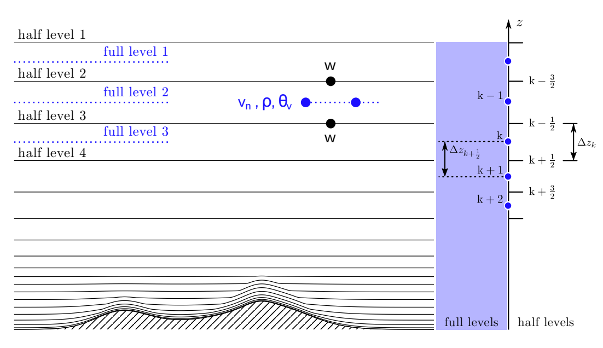
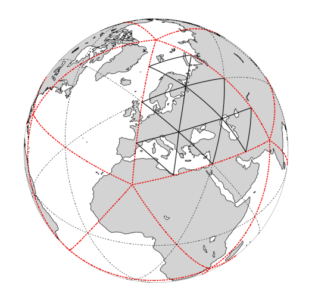
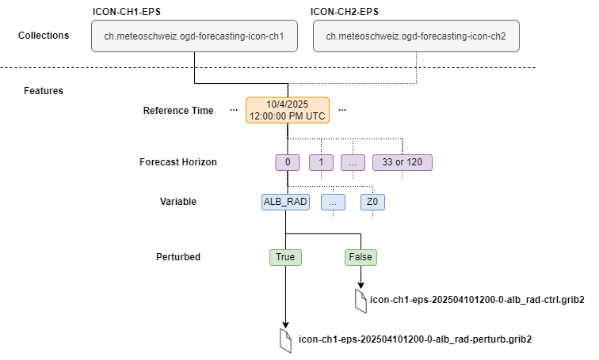
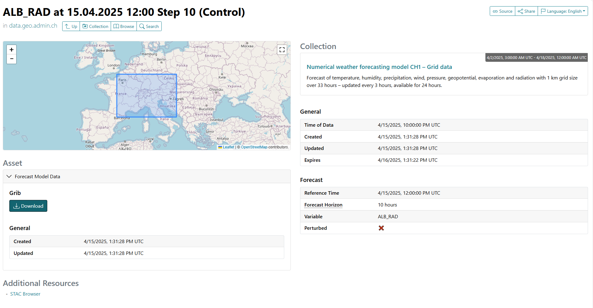

# Numerical weather forecasting model ICON-CH1/2-EPS

import BrowserOnly from '@docusaurus/BrowserOnly';
import ForecastDomainMap from './interactive-map/ForecastDomainMap';

MeteoSwiss uses two models, [**ICON-CH1-EPS** and **ICON-CH2-EPS**](https://www.meteoswiss.admin.ch/weather/warning-and-forecasting-systems/icon-forecasting-systems.html), to forecast the atmospheric state in Switzerland and its surroundings over a longer period than [nowcasting](/e-forecast-data/e1-short-term-forecast-data), providing predictions for up to five days. Both models include [ensemble data assimilation](https://www.meteoswiss.admin.ch/weather/warning-and-forecasting-systems/icon-forecasting-systems/ensemble-data-assimilation.html), where multiple simulations with slightly perturbed initial conditions help account for forecast uncertainty. Forecasts can include the full ensemble or just the unperturbed control run.

<BrowserOnly fallback={<div>Loading map...</div>}>
  {() => <ForecastDomainMap />}
</BrowserOnly>

<br></br>

The documentation covers the following topics:
- [Getting started quickly](#getting-started-quickly)
- [Available data](#available-data)
- [Data Structure](#data-structure)
- [Accessing forecast data](#accessing-forecast-data)
- [Working with the forecast data](#working-with-the-forecast-data)
- [FAQ/Troubleshooting](#faqtroubleshooting)

<br></br>

## Getting started quickly

### Example notebooks: From retrieval to visualization

To get an easy start, explore the [Jupyter notebooks](https://github.com/MeteoSwiss/opendata-nwp-demos), which provide several examples of how to access and process numerical weather prediction (nwp) model data from MeteoSwiss.

## Available data

### Model specifications

| **Attributes**| **ICON-CH1-EPS** | **ICON-CH2-EPS**|
|-----------|------------------|-----------------|
| Collection |[ch.meteoschweiz.ogd-forecasting-icon-ch1](https://data.geo.admin.ch/browser/#/collections/ch.meteoschweiz.ogd-forecasting-icon-ch1?.language=en) | [ch.meteoschweiz.ogd-forecasting-icon-ch2](https://data.geo.admin.ch/browser/#/collections/ch.meteoschweiz.ogd-forecasting-icon-ch2?.language=en) |
| Horizontal Grid Size | approx. 1 km | approx. 2.1 km |
| Ensemble Members | 11 | 21 |
| Forecast Period | 33 h | 120 h |
| Grid | Native icosahedral | Native icosahedral |
| Temporal Output Resolution |  1 h | 1 h |
| New Model Run (Initialization) | every 3 h | every 6 h |
| Output Data Format | GRIB edition 2 | GRIB edition 2 |

### Available parameters

### 🚧  **Temporary Notice Work in Progress**

Users can find information about available parameters, including metadata about height, longitude and latitude, in the collections decribed above. To access the parameter overview click on the link for the desired model. A new browser window will open; then, navigate to the `Assets` section and click the download button.

## Data Structure

### 3D model grid
The model data is structured on both a horizontal and vertical grid.

#### Vertical grid

The vertical grid above the surface is a height-based coordinate system that describes terrain-following model levels. The closer the levels are to
the surface, the narrower the layers they define, as shown in the image below. The model levels gradually change into levels of constant height as the distance from the surface increases.
Each grid box is delimited at the top and bottom by so-called **half levels** of the grid, while the **full levels** are aligned with the center of the grid box.

The vertical grid uses a Lorenz-type staggering, meaning that some parameters are defined at full levels and others, e.g. the vertical velocity `W`, at half levels.
There are 81 discrete half levels and 80 full levels in our data. The levels are numbered from top to bottom.

 <br></br>
*Illustration of ICON's vertical levels, Working with the ICON Model 2024, Figure 3.2*

<br></br>

In addition to the vertical grid above the surface (half and full levels), there is also a grid below the land surface to describe parameters such as the soil temperature for example.

In the provided model data, some variables are also defined on a surface (e.g. total precipitation), or at a specific height above ground (e.g. temperature at 2m).
To determine the vertical positioning of a parameter and the units corresponding to the vertical surface type, inspect the GRIB2 key `typeOfLevel`:

* `generalVertical`: half levels (-)

* `generalVerticalLayer`: full levels (-)

* `depthBelowLandLayer`: depth below surface (m)

* `surface`: ground or water surface (-)

* `heightAboveGround`: specific height above ground (m)

Parameters are classified as either **single-level** or **multi-level**:
- **Single-level parameters** contain data at a specific vertical level.
- **Multi-level parameters** span multiple vertical layers.

For more detailed information on the vertical grid, read section 3.4 in [Working with the ICON Model](https://www.dwd.de/DE/leistungen/nwv_icon_tutorial/pdf_einzelbaende/icon_tutorial2024.pdf?__blob=publicationFile&v=3).

#### Horizontal grid

The horizontal grid of the ICON-CH1-EPS and ICON-CH2-EPS models is based on a native icosahedral grid used by the ICON model (illustration below).

 <br></br>
*Illustration of the ICON grid structure, Working with the ICON Model, Figure 2.1*

<br></br>

Since the provided data is defined on the native grid, the horizontal grid points correspond to the **center of the circumcircle of each triangle** and **not** to the triangle’s vertices.
Therefore, the longitude and latitude information corresponds to the middle of each triangle. For more detailed information on
the horizontal grid, read section 2.1 in [Working with the ICON Model](https://www.dwd.de/DE/leistungen/nwv_icon_tutorial/pdf_einzelbaende/icon_tutorial2024.pdf?__blob=publicationFile&v=3).

### Forecast file structure

The provided GRIB2 files consistently follow the same structure. Each GRIB2 file contains data for a single model collection, one reference time, one forecast lead time, and one variable — either as the deterministic control run or the full ensemble. The following diagram shows a general overview.

 <br></br>


## Accessing forecast data

### Data availability

#### 24h window

The data provided in the two collections described in the [Model specifications table](#model-specifications) is accessible for **24 hours**.
Data older than this is no longer available.

#### GRIB format

The data is provided in GRIB2 format, which is a binary format used internationally and defined by WMO.
More information about the data format can be found in the [Manual on Codes](https://library.wmo.int/records/item/35769-manual-on-codes-volume-i-3-international-codes) published by WMO.

> ⚠️ **WARNING**: Data located at the boundary of the spatial domain may be random.

#### Forecast data volume

The following tables summarize the volume of the different forecast files for **ICON-CH1-EPS** and **ICON-CH2-EPS**.

**ICON-CH1-EPS Data Volume**
| | Single-Level Files| Multi-Level Files|
|-----------|------------------|-----------------|
| Deterministic| 199.0 Bytes - 2.2 MiB| 19.7 - 177.4 MiB|
| Perturbed | 1.9 KiB - 22.4 MiB | 197.1 MiB - 1.7 GiB |

**ICON-CH2-EPS Data Volume**
| | Single-Level Files| Multi-Level Files|
|-----------|------------------|-----------------|
| Deterministic|  175.0 Bytes - 564.7 KiB| 4.9 MiB - 43.9 MiB|
| Perturbed | 3.4 KiB - 11 MiB | 97.5 MiB - 877.5 MiB |

### Download options

import Tabs from '@theme/Tabs';
import TabItem from '@theme/TabItem';

<Tabs queryString="download-options">
    <TabItem value="python-api-access" label="Python API Access">

    One of the easiest ways to access the ICON model data is to use MeteoSwiss's [meteodata-lab](https://meteoswiss.github.io/meteodata-lab/) library - a convenient tool to simplify accessing and working with numerical weather model data.
    The library includes downloading and optionally loading ICON-CH1/CH2-EPS data into formats like [xarray.DataArray](https://docs.xarray.dev/en/stable/generated/xarray.DataArray.html).
    Ideal for users who want a clean and easy way to integrate forecast data into Python workflows.

    </TabItem>
    <TabItem value="rest-api-access-http-post" label="Rest API Access (HTTP POST)">

    Users who prefer direct API access using tools like curl or custom code in any language, they can retrieve datasets directly via the [REST API](https://data.geo.admin.ch/api/stac/static/spec/v1/apitransactional.html#tag/Data/operation/getAsset).
    Following the step-by-step instructions in this section users can obtain forecast data for specific models, parameters, and other customizable variables.

    #### Submitting a POST request

    Filtering and querying forecast data must be done using a `POST` request. To retrieve a forecast, use a tool like `curl` and send the request to the API endpoint:
    ```
    curl -X POST "https://data.geo.admin.ch/api/stac/v1/search" \
        -H "Content-Type: application/json" \
        -d '{
                "collections": [
                    "ch.meteoschweiz.ogd-forecasting-icon-ch2"
                ],
                "forecast:reference_datetime": "2025-03-12T12:00:00Z",
                "forecast:variable": "TOT_PREC",
                "forecast:perturbed": false,
                "forecast:horizon": "P0DT00H00M00S"
            }'
    ```

    Each parameter in the request body serves the following purpose:
    - `collections`: Defines the forecast model to retrieve (`ch.meteoschweiz.ogd-forecasting-icon-ch1` for ICON-CH1-EPS and `ch.meteoschweiz.ogd-forecasting-icon-ch2` for ICON-CH2-EPS).
    - `forecast:reference_datetime`: Specifies the desired forecast initialization time (e.g., `2025-03-12T12:00:00Z`).
    - `forecast:variable`: Indicates the meteorological parameter of interest (`TOT_PREC` for total precipitation, for example).
    - `forecast:perturbed`: Boolean flag determining if the request is for deterministic (`false`) or ensemble (`true`) data.
    - `forecast:horizon`: Defines the forecast lead time to retrieve in ISO 8601 duration format (`P0DT00H00M00S` for data at +0h lead time, i.e. initialization).

    #### Downloading the forecast data

    Upon a successful request, the response will contain a dictionary of metadata, including forecast file links under the `assets` key. Locate the `href` field containing the pre-signed URL.
    Download the GRIB file containing the forecast data using the following command:
    ```
    wget -O <desired_filename> “<pre-signed URL>”
    ```

    After downloading your forecast data, it's good practice to verify its integrity before use.

    #### Verifying the data integrity

    To ensure that the downloaded file is not corrupted, compute its SHA-256 hash and verify it against the checksum provided in the file's header field.

    **Steps:**
    1. Open a terminal and generate the SHA-256 checksum of the downloaded file:
    ```
    sha256sum <downloaded_filename>
    ```

    2. Retrieve the checksum from the file’s header field `x-amz-meta-sha256` using the following command:
    ```
    curl -s -i "<pre-signed URL>" | awk -F': ' '/x-amz-meta-sha256/ {print $0}'
    ```

    3. Compare the two hash values. If they match, your forecast data file is safe to use.

    <br></br>

    Once the file is verified, you can proceed with reading the GRIB file, using e.g. the instructions in [Decoding GRIB files with ecCodes](#decoding-grib-files-with-eccodes).

    #### Accessing static grid information: Height, longitude and latitude
    > ❗ **NOTE**: Forecast GRIB files do not contain information about height, longitude and latitude. To geolocate or interpret vertical levels, you must use the static vertical and horizontal grid parameter files provided in each collection.
    > 💡 **Tip for new users**: We recommend inexperienced GRIB file users to take a look at the provided [Jupyter Notebooks](https://github.com/MeteoSwiss/opendata-nwp-demos). The data retrieval with the Python API includes fetching longitude and latitude.


    Besides the current forecast files, each collection contains two static files. They store constant information about the height of the half levels (HHL) in the vertical grid and the center point coordinates of each triangle on the horizontal grid.


    ##### Accessing horizontal grid parameters

    The static horizontal file stores the longitude and latitude of the center points of each triangle in the horizontal grid. To retrieve this information, follow the steps below:

    1. Submit a GET request specifying the collection you want to download the static horizontal files from (eg. `ch.meteoschweiz.ogd-forecasting-icon-ch1` for ICON-CH1-EPS).
    ```
    curl -X GET https://data.geo.admin.ch/api/stac/v1/collections/ch.meteoschweiz.ogd-forecasting-icon-ch1/assets
    ```
    2. Locate the `href` field under `assets` in `id: horizontal_constants_icon-ch1-eps.grib2` and copy the pre-signed URL.
    3. Download the file with:
    ```
    wget -O <desired_filename> “<pre-signed URL>”
    ```
    4. Once the static GRIB file is downloaded, ensure that the `uuidOfHGrid` (Universally Unique Identifier for the horizontal grid) key in the data file matches the one in the static horizontal file.

    ##### Accessing vertical grid parameters

    In the static vertical file, the heights of the half levels of the vertical grid are provided in meters above mean sea level. In order to associate a value from a data file (for a given parameter) to a height in meters above sea level, follow the steps below:

    1. Submit a GET request specifying the collection you want to retrieve the static vertical files from (e.g., `ch.meteoschweiz.ogd-forecasting-icon-ch1` for ICON-CH1-EPS):
    ```
    curl -X GET https://data.geo.admin.ch/api/stac/v1/collections/ch.meteoschweiz.ogd-forecasting-icon-ch1/assets
    ```
    2. Locate the `href` field under `assets` in `id: vertical_constants_icon-ch1-eps.grib2` and copy the pre-signed URL.
    3. Download the file with:
    ```
    wget -O <desired_filename> “<pre-signed URL>”
    ```
    4. Once the static GRIB file is downloaded, verify that the `uuidOfVGrid` (Universally Unique Identifier for the vertical grid) key in the data file matches the one in the HHL file.
    5. Retrieve the value for the `level` key and inspect the `typeOfLevel` key by listing the GRIB messages:
        - **generalVertical**: The value of `level` corresponds to a half level in the HHL file. For each level (i.e., each GRIB message), the variable `h` provides the height in meters above sea level for every grid point.
        - **generalVerticalLayer**: The `level` value corresponds to a full level. To obtain the height in meters above sea level, average the heights of the two surrounding half levels (above and below).
        - **Other types of level**: These are usually specified directly in meters and are self-explanatory.

    </TabItem>
    <TabItem value="manual-download-via-stac-browser" label="Manual download via STAC Browser">
    If users prefer to use a web interface to donwload available forecast GRIB files one by one or want to browse them,
    they can use the STAC Browser of the model [ICON-CH1-EPS](https://data.geo.admin.ch/browser/#/collections/ch.meteoschweiz.ogd-forecasting-icon-ch1?.language=en) or     [ICON-CH2-EPS](https://data.geo.admin.ch/browser/#/collections/ch.meteoschweiz.ogd-forecasting-icon-ch2?.language=en).

    The Screenshot below shows the download button of the STAC catalog of the model ICON-CH1-EPS.

    

    Simply click on the provided download button and the browser will handle the rest.
    The GRIB files are saved into your Downloads folder or the location where your browser stores downloaded files.
    You can access them there once the download is completed.
    </TabItem>
</Tabs>

## Working with the forecast data

### Exploring GRIB files in Python
Several Jupyter Notebooks explain how to download and work with forecast files in [xarray.DataArray](https://docs.xarray.dev/en/stable/generated/xarray.DataArray.html) format.
To explore them, check out the GitHub repository [opendata-nwp-demos](https://github.com/MeteoSwiss/opendata-nwp-demos).

### Reading GRIB files using ecCodes

Working with the raw GRIB files, you need a tool to decode the GRIB records. Each GRIB record holds the data for one parameter
at one time and at one level. More information about the data format can be found in the [Manual on Codes](https://library.wmo.int/records/item/35769-manual-on-codes-volume-i-3-international-codes) published by WMO.
We recommend installing ecCodes from ECMWF to read the data. Follow the installation guide provided by ECMWF [here](https://confluence.ecmwf.int/display/ECC/ecCodes+installation).

#### Setting the local definitions of the COSMO consortium

The GRIB format relies on tables and templates to encode the metadata. Those tables allow for example the mapping of a triplet of numbers encoding a parameter to a descriptive string (`shortName`). The international tables are provided in ecCodes. Additionally,
local definitions can be defined by each center. ECMWF specific definitions are also shiped with ecCodes. Some of the provided ICON data also requires the local definitions of the COSMO consortium.
In order to provide a consistent and comprehensive set of GRIB tables, check the ecCodes version you installed and clone the
**corresponding version** of the GRIB tables in the same folder:

- Releases for [COSMO-ORG/eccodes-cosmo-resources](https://github.com/COSMO-ORG/eccodes-cosmo-resources/releases)
- Releases for [ecmwf/eccodes](https://github.com/ecmwf/eccodes/releases)

Then, set `GRIB_DEFINITION_PATH` for ecCodes to use those tables (add it to your `.bashrc` to make if availabe in each terminal session):

```
export GRIB_DEFINITION_PATH=<name_of_your_folder>/eccodes-cosmo-recources/definitions:<name_of_your_folder>r/eccodes/definitions
```

To check the details of your information, you can run

```
codes_info
```

#### Decoding GRIB files with ecCodes

This section provides a brief introduction to decoding GRIB files using command-line tools provided by **ecCodes**.
There are also C, Fortran 90 and Python interfaces, please refer to the [ecCodes documentation](https://confluence.ecmwf.int/display/ECC).

Please look up the use of the command-line tools in the [ECMWF documentation](https://confluence.ecmwf.int/display/ECC/GRIB+tools).

Some useful commands are:

- List all the GRIB messages in a file:
```
grib_ls filename.grib
```

- Filter GRIB messages based on key-value conditions:
```
grib_ls -w key1=value1,key2=value2 filename.grib
```

- Specify a list of keys to be printed:
```
grib_ls -p key1,key2 filename.grib
```

- Get a detailed view of the content of all GRIB messages:
```
grib_dump filename.grib
```
- Get a detailed view of GRIB messages with filters:
```
grib_dump -w key1=value1,key2=value2 filename.grib
```

## FAQ/Troubleshooting

<details>
<summary> <b> "Why can't I find latitude or longitude?" </b> </summary>

Raw forecast GRIB files loaded via the REST API do not contain information about height, longitude and latitude.
To geolocate or interpret vertical levels, you must use the static vertical and horizontal grid parameter files provided in each collection.
For more information, read section [Accessing static grid information: Height, longitude and latitude](#accessing-static-grid-information-Height-longitude-and-latitude).
</details>

<details>
<summary> <b> "Why does my download expire?" </b> </summary>

The data provided in the two collections described in the [Model specifications table](#model-specifications) is accessible for only **24 hours**. After 24 hour the data expires.
</details>

<details>
<summary> <b> "How to interpret different types of levels?" </b> </summary>

To determine the type of level (vertical position) of a parameter, inspect the GRIB2 key `typeOfLevel`. We distinguish between the following:

* `generalVertical`: half levels (-)

* `generalVerticalLayer`: full levels (-)

* `depthBelowLandLayer`: depth below surface (m)

* `surface`: ground or water surface (-)

* `heightAboveGround`: specific height above ground (m)

For more details, refer to section [Vertical grid](#vertical-grid).
</details>
