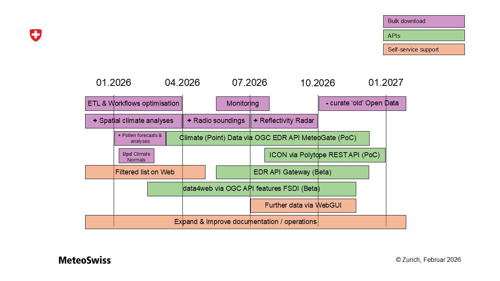

# Roadmap
This is the **current roadmap of our Open Data service**, which will guide us through the year 2026.
- It is iterated on at least a quarterly basis.
- It allows us to plan for change. It captures intent, not solutions. The further into the future a thing will take place, the more uncertain it is. 
- Things can be added to or dropped from the roadmap. In the latter case, we document this below under ‘Items removed from the roadmap’, including the date and reason. 

:::tip

The roadmap is based on the [**Vision and strategy** of MeteoSwiss' Open Data provision](./background-objectives#vision-mission-and-strategy-of-meteoswiss-open-data-provision). In a nutshell:
- MeteoSwiss is implementing Open Data access in two stages, first through bulk download, then through APIs.
- Where implemented, both access modes remain operational.

:::

## January until March (Q1-2026)

### Bulk download

  
Open Data extracted from the data warehouse is available faster than their measurement frequency.

  'Extract, transform and load' is optimised. `ITD-3733`   
  'Author, schedule and monitor workflows' is optimised. `ITD-3734`

  
'Spatial climate analyses' are available.

  
  Including archived data. 

  
'Spatial climate normals' are updated.

  
  More about [this open data product](https://opendatadocs.meteoswiss.ch/c-climate-data/c7-spatial-climate-normals).

  
'Pollen forecast data' is available as an additional parameter of the 'Numerical weather forecasting model ICON-CH2-EPS'.

  Pollen variables are only generated when activated during the season. `APNRZ-951`   
  More about [the 'ICON-CH2-EPS' open data product](https://opendatadocs.meteoswiss.ch/e-forecast-data/e2-e3-numerical-weather-forecasting-model).

  
'Pollen analysis data' is available.

  Hourly KENDA analysis data. Level 80 (to be confirmed) and only ctrl run. `APNRZ-951`

### APIs

  
'Homogeneous Climate data series' are being made available via MeteoGate's Climate data EDR API.

  More about EUMETNET's [MeteoGate](https://meteogate.eu).   
  More about [the 'Homogeneous Climate data series' product](https://opendatadocs.meteoswiss.ch/c-climate-data/c1-climate-stations_homogeneous).

  
'Local forecast data' are being made available via FSDI's OGC Feature API.

  More about [the 'Local forecast data' product](https://opendatadocs.meteoswiss.ch/e-forecast-data/e4-local-forecast-data).

## April until June (Q2-2026)

### Bulk download

  
...

  ...

### APIs

  
'Homogeneous Climate data series' are being made available via MeteoGate's Climate data EDR API.

  More about EUMETNET's [MeteoGate](https://meteogate.eu).   
  More about [the 'Homogeneous Climate data series' product](https://opendatadocs.meteoswiss.ch/c-climate-data/c1-climate-stations_homogeneous).

  
'Local forecast data' are being made available via FSDI's OGC Feature API.

  More about [the 'Local forecast data' product](https://opendatadocs.meteoswiss.ch/e-forecast-data/e4-local-forecast-data).

## Items removed from the roadmap
(*here comes a table with 'date', 'item' and 'reason of removal'*)
