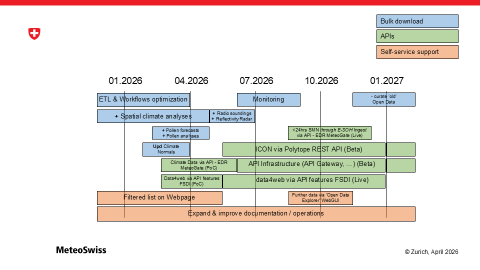

# Roadmap
This is the **current roadmap of our Open Data service**, which shows what we are working on and when.
- It is iterated on at least a quarterly basis.
- It allows us to plan for change. It captures intent, not solutions. The further into the future a thing will take place, the more uncertain it is. 
- Things can be added to or dropped from the roadmap. In the latter case, we document this below under ‘Items removed from the roadmap’, including the date and reason. 

:::tip

The roadmap is based on the [**Vision and strategy** of MeteoSwiss' Open Data provision](./background-objectives#vision-mission-and-strategy-of-meteoswiss-open-data-provision). In a nutshell:
- MeteoSwiss is implementing Open Data access in two stages, first through bulk download, then through APIs.
- Where implemented, both access modes remain operational.

:::

## July until September (Q3-2026)

### Bulk download

  
The provision of real-time 'Ground-based measurements' and 'Radar data' will be improved by end of August.

  
  The aim is to make the respective Open Data available, where possible, within the measurement interval.

  
'Radio soundings' are being prepared to be available by end of September

  
  More about [this open data product (B1)](https://opendatadocs.meteoswiss.ch/b-data-atmosphere).

  
'Reflectivity-based' and 'Convection radar products' are being prepared to be available by end of September

  
  More info about these open data products will be coming soon.

### APIs

  
A proof of concept for the provision of 'Homogeneous Climate data series' via MeteoGate's climate data EDR API is being developed until the end of the current year.

  More about EUMETNET's [MeteoGate](https://meteogate.eu).  
  More about [the 'Homogeneous Climate data series' product](https://opendatadocs.meteoswiss.ch/c-climate-data/c1-climate-stations_homogeneous).

  
A beta version for the provision of 'Local forecast data' via FSDI's upcoming OGC Feature API is being developed until the end of the current year.

  More about [the 'Local forecast data' product](https://opendatadocs.meteoswiss.ch/e-forecast-data/e4-local-forecast-data).

  
A beta version for the provision of 'Numerical weather forecasting model ICON-CH1/2-EPS' via Meteoswiss' upcoming OGC EDR API is being developed until the end of the current year.

  More about [the 'Numerical weather forecasting model ICON-CH1/2-EPS' products](https://opendatadocs.meteoswiss.ch/e-forecast-data/e2-e3-numerical-weather-forecasting-model).

### Self-service support

  
:heavy_check_mark: [Open Data products can be filtered by parameter groups](https://www.meteoswiss.admin.ch/services-and-publications/service/open-data.html#ogd-q=&ogd-cat=&ogd-fmt=&ogd-kw=) on MeteoSwiss' respective webpage by end of July.

  
The Open Data documentation is continuosly updated and improved.

## Items removed from the roadmap
(*here comes a table with 'date', 'item' and 'reason of removal'*)
